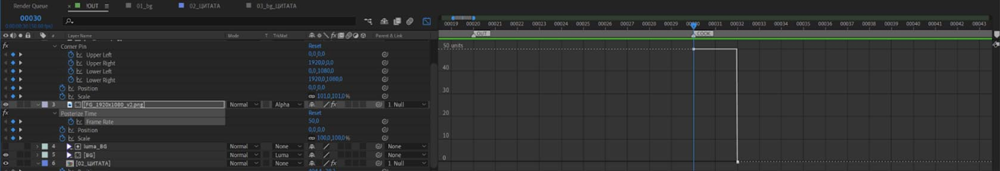

# 2. Работа с эффектами

## 2.1. Поддерживаемые эффекты и правила работы с ними

|**Поддерживаемые эффекты**              |
|:---------------------------------------|
| Blur & Sharpen - Sharpen               |
| Blur & Sharpen - Fast Box Blur         |
| Distort - Displacement Map             |
| Distort - Corner Pin                   |
| Time - Posterize Time                  | 
| Generate - Fill                        | 
| Generate - Gradient Ramp               | 
| Color Correction - Tritone             | 
| Color Correction - Tint                | 
| Color Correction - Levels              | 
| Color Correction - Curves              | 
| Expression Controls - 3D Point Control | 
| Expression Controls - Angle Control    | 
| Expression Controls - Checkbox Control | 
| Expression Controls - Color Control    | 
| Expression Controls - Point Control    | 
| Expression Controls - Slider Control   | 
| Transition - Wipes - Linear Wipe       | 

---

### 2.1.1. Ограничения:
- `Gradient Ramp` работает только в режиме `Linear Ramp`.
- `Fill` – `Fill Mask` не поддерживается.
- Для работы с `Track Matte` со слоями на которых применены `Fast Box Blur` или `Displacement Map`, необходимо переместить слой с этими эффектами в `Precomposition`.

---
---

## 2.2. Fast Box Blur особенности и ограничения

Доступный для изменения параметр `Fast Box Blur` в **Carrot** — `Blur Radius`, остальные параметры эффекта фиксированные:
- `Repeat Edge Pixels` – On;
- `Iterations` - 3;
- `Blur Dimensions` – Horizontal and Vertical.

---

- *При необходимости работы с `Track Matte` со слоем, к которому применён `Fast Box Blur`, данный слой предварительно переносится в `Precomposition`.*
- *Для корректной работы `Fast Box Blur` должен находится первым в списке эффектов на слое. Аналогичным, но не предпочтительным, способом можно разместить слой с другими эффектами в `Precomposition`, на который уже применить `Fast Box Blur`.*

---
---

## 2.3. Posterize Time

Данный эффект используется для создания стоп-кадров, работает в значениях 50 и 0. Ключи должны быть жесткими.

*Пример использования: создания стоп-кадра в Carrot из проходного сигнала в момент запуска шаблона.*

---

[Вернуться на прошлую страницу](user-guide.md)