# 7. Экспорт шаблонов в Carrot

## 7.1. Подготовка проекта, сохранение, экспорт и настройка шаблона

1. Выберите меню **Composition - Export Carrot Template**.

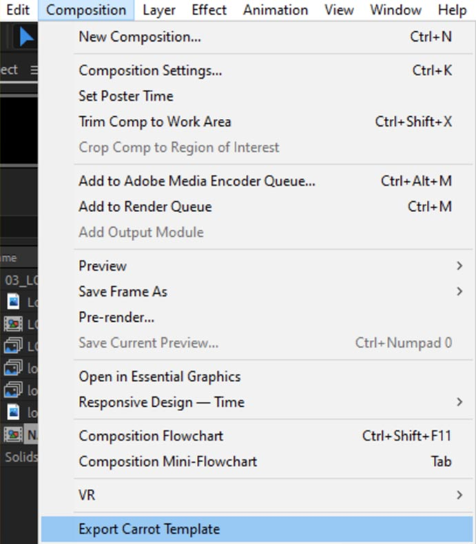

*Примечание: если этот пункт не активен, нажмите на раздел с композициями в нижней части интерфейса After Effects.*

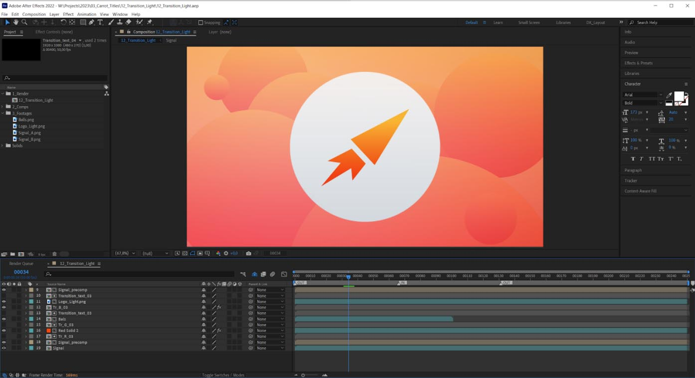

2. Появится окно **Template Preview**.

3. Откройте вкладку Animation в центральном разделе Viewport.

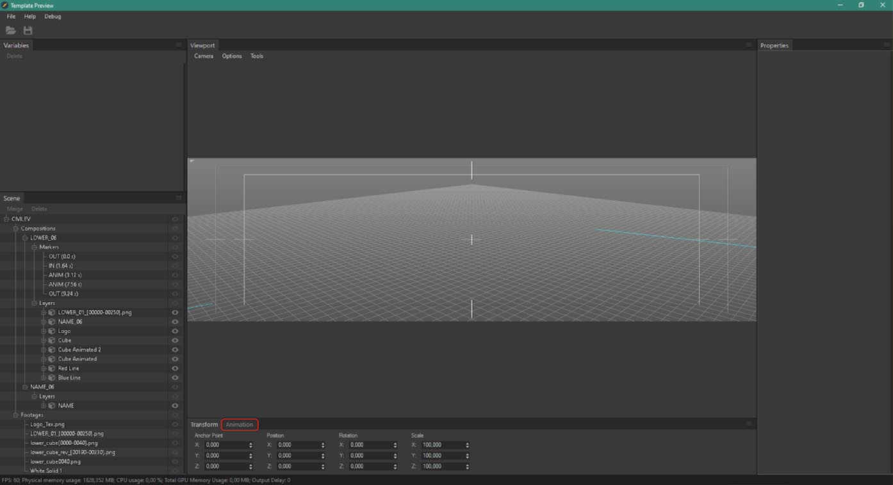

4. В поле **Composition** выберите композицию, которая была экспортирована. Благодаря маркерам здесь появились три стейта:

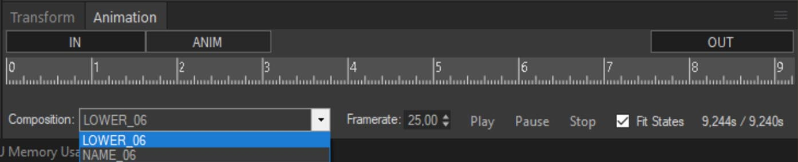

- IN (*соответствует промежутку OUT-IN*)
- ANIM (*соответствует промежутку IN-ANIM*)
- OUT (*соответствует промежутку ANIM-OUT*)

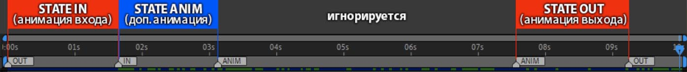

5. Проверьте правильность воспроизведения анимации:
- Нажмите на название стейта.

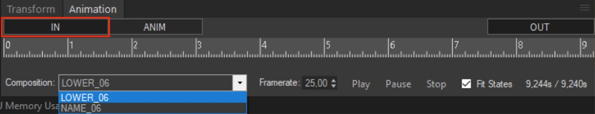

- Дождитесь завершения проигрывания.
6. Нажмите кнопку **Save Template**.

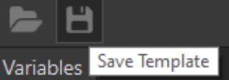

7. В новом окне выберите директорию для сохранения шаблона.
8. В поле **Name** задайте название шаблона.
9. Нажмите на поле **Container**.
10. В появившемся окне выберите нужную схему движка и укажите
соответствующий контейнер ( [подробнее о контейнерах и схемах Carrot Engine](https://carrotsoftware.github.io/docs/#/settings?id=%d0%a0%d0%b0%d0%b7%d0%b4%d0%b5%d0%bb-engines) ).

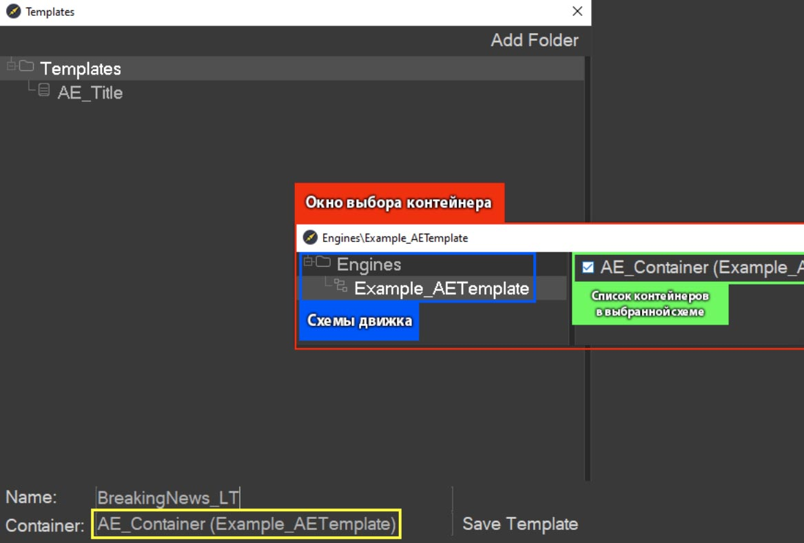

11. Нажмите на кнопку Save Template.
12. Закройте Template Preview.

---

## 7.2. Работа с текстом в Carrot. Настройки растеризации (StepCount) и вертикального выравнивания (VerticalAlignment).

1. Выберите текстовой слой.

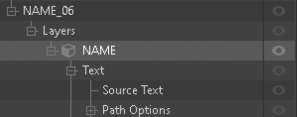

2. В разделе Properties измените параметр StepCount на желаемый:

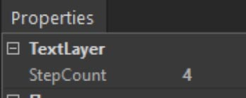

Примеры значений параметра StepCount:

StepCount = 1:

StepCount = 2:

StepCount = 4:

>Примечание: чем больше значение параметра StepCount, тем больше потребляется ресурсов ГП на отрисовку текста.

В Carrot присутствует функционал вертикального выравнивания текстового блока, недоступный в After Effects. Выбор режима выравнивания происходит следующим образом:
1. Раскройте свойства текстового слоя
2. Выберите свойство Source Text
3. В окне Properties укажите параметр VerticalAlignment

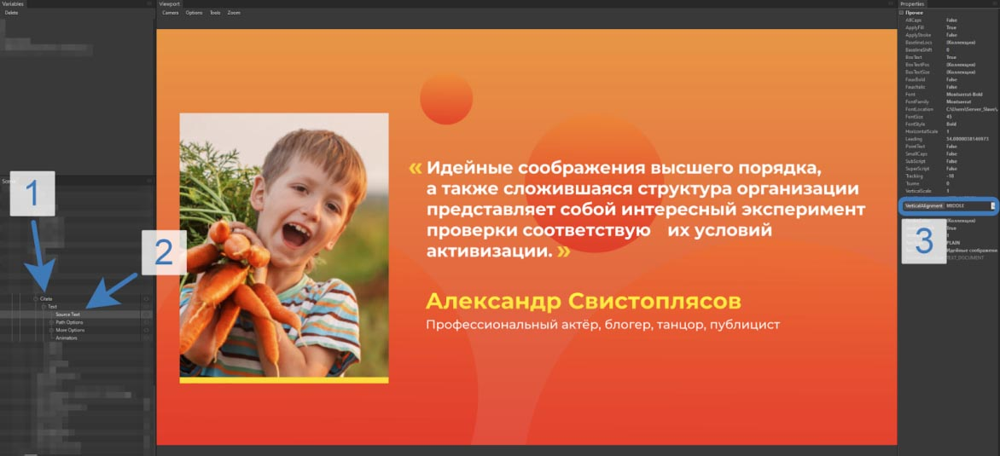

Сохранение параметра выравнивания текстового слоя не поддерживается.

---

[Вернуться на прошлую страницу](user-guide.md)