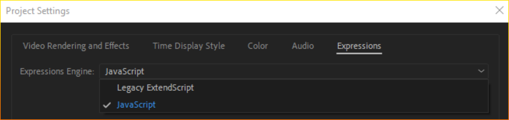

# Работа с выражениями (Expression)

## Особенности работы с выражениями

В рамках работы с выражениями через Expressions и Carrot Scripts поддерживаются следующие методы:

>Global:
- comp(name)
- footage(name)
- thisProject
- thisComp
- thisLayer
- thisProperty
- time
- value

>Other Math:
- degreesToRadians(degrees)
- radiansToDegrees(radians)

>Comp:
- Comp.layer(index)
- Comp.layer(name)
- Comp.width
- Comp.height
- Comp.duration
- Comp.name

>Footage:
- Footage.width
- Footage.height
- Footage.duration
- Footage.pixelAspect
- Footage.name

>Property:
- value

>Layer Sub-objects:
- Layer.effect(name)
- Layer.effect(index)

>Layer General:
- Layer.width
- Layer.height
- Layer.index
- Layer.parent
- Layer.hasParent
- Layer.inPoint
- Layer.outPoint
- Layer.startTime

>Layer Properties:
- Layer.anchorPoint
- Layer.position
- Layer.scale
- Layer.rotation
- Layer.opacity
- Layer.name

>Layer 3D:
- Layer.orientation
- Layer.rotationX
- Layer.rotationY
- Layer.rotationZ

---

**Text:**

Text.Font - используйте TextSource.FontSize, т.к. Carrot использует свой метод отрисовки текста.

Поддержка остальных методов не гарантируется, но возможна после обращения в техническую поддержку.

Для выражений используется логика и синтаксис аналогично JavaScript Expression Engine, которая отличается от ExtendScript, который может быть выставлен по умолчанию.

Подробнее по [ссылке.](https://helpx.adobe.com/au/after-effects/using/legacy-and-extend-script-engine.html)

---

**Особенности метрических систем Adobe After Effects и Carrot Engine/Unreal Engine!**

**SourceRectAtTime.width** (*получение ширины слоя в пикселях*), применяемый к текстовому слою вернет в **Carrot** значение аналогично **AE** (1000), если применять фунцию к **Solid** слою, вернется значение в **1000** меньше (*0,5 вместо 500*), соответственно расчёты станут неверными, если не делать доп преобразований. 

Для необходимости сопоставления объектов с трекинг данными от трекинг систем (*stYpe, MoSys и т.д.*) в **Carrot** используется преобразование входящих значений в **unit**, где **1 unit = 1/1000px** (*система измерения AE*). Это преобразование не касается **Text Layer**. 

На производительность влияет по большей части не содержание выражений, а их количество в проекте.

---

## Расширенные [custom] выражения реализованные посредством Carrot Script. (примеры)
 

- thisLayer.charpos(1) - возвращает координаты X,Y первого символа текстового слоя
- thisLayer.lastcharpos() - возвращает координаты последнего символа X,Y текстового
слоя

 

- app.effects - список доступных эффектов
- app.numeffects - количество доступных эффектов
- app.project - сцена
- app.project.comp("compname") - композиция сцены

 

- time - текущее время (в секундах с момента старта шаблона)
- thisComp.CurrentTime - текущее время (в секундах с момента старта шаблона)

 

- st - системное время
- st.hour - часы (формат int)
- st.minute - минуты (формат int)
- st.second - секунды (формат int)
- st.getsecond() - возвращает значение секунд из системное времени
- st.getminute() - возвращает значение минут из системное времени
- st.gethour() - возвращает значение часов из системное времени
- st.getcounthour(hour,minute,second) - разница в часах между тем, что указано в аргументах и текущим временем.
- st.getcountminute(hour,minute,second) - разница в минутах между тем, что указано в аргументах и текущим временем.
- st.getcountsecond(hour,minute,second) - разница в секундах между тем, что указано в аргументах и текущим временем.
- st.gethouroffset(hour, minute, second) - возвращает системное время в часах с пользовательским смещением
- st.getminuteoffset(hour, minute, second) - возвращает системное время в минутах с пользовательским смещением
- st.getsecondoffset(hour, minute, second) - возвращает системное время в секундах с пользовательским смещением
- st.gethourinv(int offset) - смещение минус часы (текущее время) (формат string "00")
- st.getminuteinv(int offset) - смещение минус минуты (текущее время) (формат string "00")
- st.getsecondinv(int offset) - смещение минус секунды (текущее время) (формат string "00")

---

[Вернуться на прошлую страницу](user-guide.md)