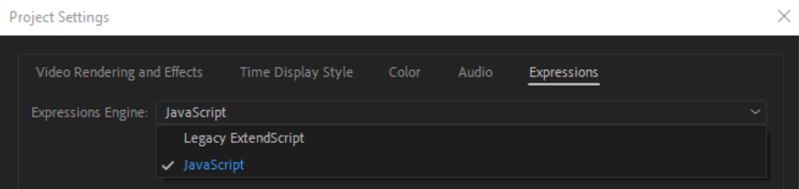

# Работа с выражениями (Expression)

## Особенности работы с выражениями

В рамках работы с выражениями через Expressions и Carrot Scripts поддерживаются следующие методы:

>Global:
- comp(name)
- footage(name)
- thisProject
- thisComp
- thisLayer
- thisProperty
- time
- value

>Other Math:
- degreesToRadians(degrees)
- radiansToDegrees(radians)

>Comp:
- Comp.layer(index)
- Comp.layer(name)
- Comp.width
- Comp.height
- Comp.duration
- Comp.name

>Footage:
- Footage.width
- Footage.height
- Footage.duration
- Footage.pixelAspect
- Footage.name

>Property:
- value

>Layer Sub-objects:
- Layer.effect(name)
- Layer.effect(index)

>Layer General:
- Layer.width
- Layer.height
- Layer.index
- Layer.parent
- Layer.hasParent
- Layer.inPoint
- Layer.outPoint
- Layer.startTime

>Layer Properties:
- Layer.anchorPoint
- Layer.position
- Layer.scale
- Layer.rotation
- Layer.opacity
- Layer.name

>Layer 3D:
- Layer.orientation
- Layer.rotationX
- Layer.rotationY
- Layer.rotationZ

---

**Text:**

Text.Font - используйте TextSource.FontSize, т.к. Carrot использует свой метод отрисовки текста.

Поддержка остальных методов не гарантируется, но возможна после обращения в техническую поддержку.

Для выражений используется логика и синтаксис аналогично JavaScript Expression Engine, которая отличается от ExtendScript, который может быть выставлен по умолчанию.

Подробнее по [ссылке.](https://helpx.adobe.com/au/after-effects/using/legacy-and-extend-script-engine.html)

---

**Особенности метрических систем Adobe After Effects и Carrot Engine/Unreal Engine!**

**SourceRectAtTime.width** (*получение ширины слоя в пикселях*), применяемый к текстовому слою вернет в **Carrot** значение аналогично **AE** (1000), если применять фунцию к **Solid** слою, вернется значение в **1000** меньше (*0,5 вместо 500*), соответственно расчёты станут неверными, если не делать доп преобразований. 

Для необходимости сопоставления объектов с трекинг данными от трекинг систем (*stYpe, MoSys и т.д.*) в **Carrot** используется преобразование входящих значений в **unit**, где **1 unit = 1/1000px** (*система измерения AE*). Это преобразование не касается **Text Layer**. 

На производительность влияет по большей части не содержание выражений, а их количество в проекте.

---

## Расширенные [custom] выражения реализованные посредством Carrot Script. (примеры)

| **РАБОТА СО ВРЕМЕНЕМ** |               |                                                                                                      |
|:---------------------- |:--------------|:-----------------------------------------------------------------------------------------------------|
| **Команда**            | **Аргументы** | **Описание**                                                                                         |
| time                   | \-            | Возвращает значение времени AE композиции в секундах                                                 |
| thisComp.CurrentTime   | \-            | Возвращает значение времени AE композиции в секундах                                                 |
| st.hour                | \-            | Возвращает значение часа системного времени в формате от 0 до 59                                     |
| st.minute              | \-            | Возвращает значение минут системного времени в формате от 0 до 59                                    |
| st.second              | \-            | Возвращает значение секунд системного времени в формате от 0 до 59                                   |
| st.gethour()           | \-            | Возвращает значение часа системного времени в формате от 00 до 59                                    |
| st.getminute()         | \-            | Возвращает значение минут системного времени в формате от 00 до 59                                   |
| st.getsecond()         | \-            | Возвращает значение секунд системного времени в формате от 00 до 59                                  |
| st.gethouroffset       | (hh,mm,ss)    | Возвращает значение часа системного времени + смещение в формате от 00 до 59                         |
| st.getminuteoffset     | (hh,mm,ss)    | Возвращает значение минут системного времени + смещение в формате от 00 до 59                        |
| st.getsecondoffset     | (hh,mm,ss)    | Возвращает значение секунд системного времени + смещение в формате от 00 до 59                       |
| st.gethourinv          | (hh)          | Возвращает пользовательское значение - значение часа системного времени в формате от 00 до 59        |
| st.getminuteinv        | (mm)          | Возвращает пользовательское значение - значение минут системного времени в формате от 00 до 59       |
| st.getsecondinv        | (ss)          | Возвращает пользовательское значение - значение секунд системного времени в формате от 00 до 59      |
| st.getcounthour        | (hh,mm,ss)    | Возвращает разницу между пользовательским значением часа и текущим системным в формате от 00 до 59   |
| st.getcountminute      | (hh,mm,ss)    | Возвращает разницу между пользовательским значением минут и текущим системным в формате от 00 до 59  |
| st.getcountsecond      | (hh,mm,ss)    | Возвращает разницу между пользовательским значением секунд и текущим системным в формате от 00 до 59 |

| **РАБОТА С ТЕКСТОМ**            |                     |                                                                     |                                                                                                            |
|:--------------------------------|:--------------------|:--------------------------------------------------------------------|:-----------------------------------------------------------------------------------------------------------|
| **Команда**                     | **Аргументы**       | **Описание**                                                        | **Пример**                                                                                                 |
| TextSource.Text                 | \-                  | Возвращает/задает текстовое значение указанного текстового слоя     | thisComp.layer(1).TextSource.Text  comp("MainComp").layer("TextLayer").TextSource.Text = "TextValue" |
| TextSource.BoxTextSize          | \-                  | Возвращает размер Paragraph Text Box указанного текстового слоя     | thisComp.layer(1).TextSource.BoxTextSize                                                                   |
| TextSource.BoxTextSize.setValue | (\[width, height\]) | Задает размер Paragraph Text Box указанного текстового слоя         | thisComp.layer(1).TextSource.BoxTextSize.setValue(\[300, 100\])                                            |
| lastcharpos()                   | \-                  | Возвращает координаты последнего символа указанного текстового слоя | thisComp.layer(1).lastcharpos()                                                                            |
| charpos                         | (number)            | Возвращает координаты выбранного символа указанного текстового слоя | thisComp.layer(1).charpos(1)                                                                               |

| **РАБОТА С ЭФФЕКТАМИ**        |                  |                                                                                        |                                                                       |
|:------------------------------|:-----------------|:---------------------------------------------------------------------------------------|:----------------------------------------------------------------------|
| **Команда**                   | **Аргументы**    | **Описание**                                                                           | **Пример**                                                            |
| effect("Fill").Color          | \-               | Возвращает значение цвета эффекта "Fill" у указанного слоя                             | thisComp.layer(1).effect("Fill").Color                                |
| effect("Fill").Color.setValue | (\[R, G, B, A\]) | Задает значение цвета эффекта "Fill" у указанного слоя в формате Normalized Float RGBA | thisComp.layer(1).effect("Fill").Color.setValue(\[0.1, 0.5, 0.9, 0\]) |

---

[Вернуться на прошлую страницу](user-guide.md)