# **1. Работа со слоями**

## 1.1. Поддерживаемые типы слоев

**Carrot Engine** поддерживает следующие типы слоев из **After Effects** при экспорте с помощью **Carrot AE Plugin**:

### 1.1.1. Null Layer

Работает аналогично **AE**, к нему можно парентить другие слои, анимировать и применять эффекты, использовать в эскпрешенах и т.д. 

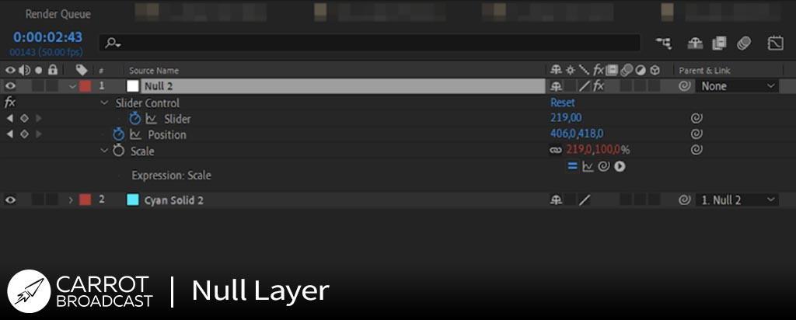

---

### 1.1.2. Solid Layer
   Аналогично **АЕ**. Отличие только в том, что в **Carrot** этот тип слоя рисуется в режиме **Bicubic sampling** (*пример на рис. ниже*)

   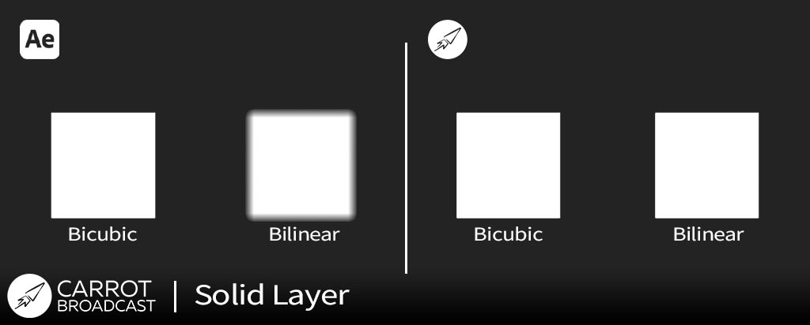

---

### 1.1.3. Shape Layer
   Для работы с **Shape Layers** их необходимо перед экспортом из After Effects в Carrot конвертировать в **кривые Безье**

   

   Поддерживается **Stroke** со скругленными краями, с возможностью редактирования толщины обводки (*Stroke Width*) и применения сплошной заливки (*Fill*)

   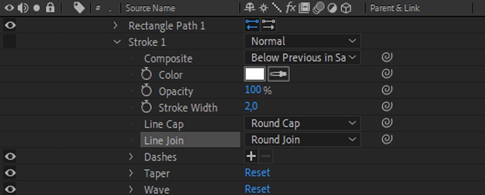

   Для применения масок на слое **Shape** необходимо предварительно переместить данный слой в **Precomposition** или использовать **Track Matte**
   
   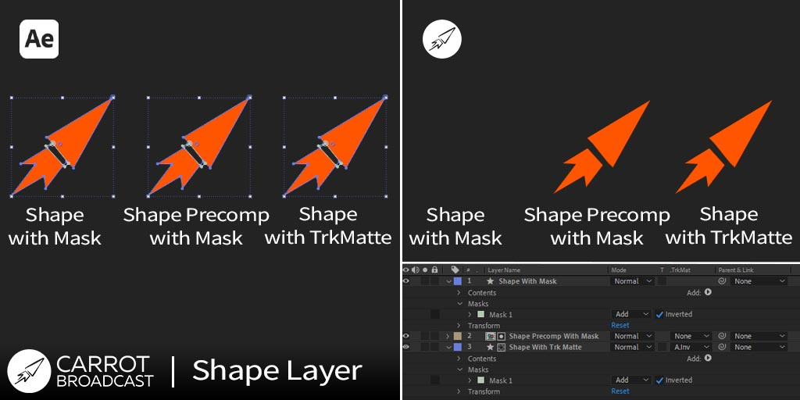 

   Векторные слои имеют ограничения по размеру композиции. Это нужно учитывать при построении архитектуры композиции. Для работы в режиме реального времени векторный слой растрируется и его **масштабирование более 100% может вызвать появление артефактов**. Аналогичным образом слой может обрезаться по границе композиции при масштабировании.

   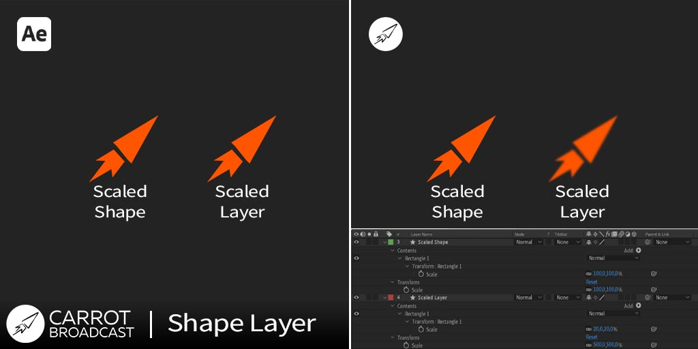

---

### 1.1.4. Text Layer

О работа с текстовыми блоками можно ознакомиться по [ссылке](texts.md)

---

### 1.1.5. Media Layer
   Для циклического воспроизведения видео в **Carrot** нужно указать **Loop Times больше 1**

   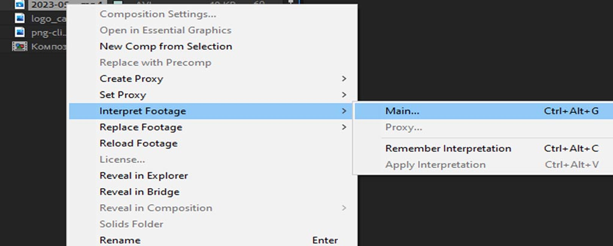
   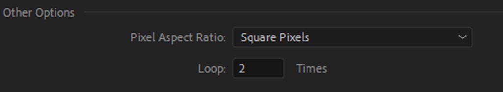
   
   Важно учитывать **Frame Rate** шаблона и тракта (*настроенного в Carrot Flow Chart*), проигрывание всей медиа будет происходить с этим **FPS** (*ускорение или замедление при несоответствии Frame Rate*)

   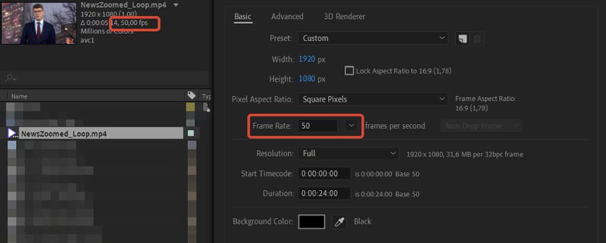

---

### 1.1.6. 3D слои

**Carrot Engine** считывает систему измерений из **After Effects** в **миллиметрах**, 

*1000px в After Effects = 1000mm в Carrot Engine*

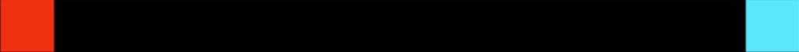
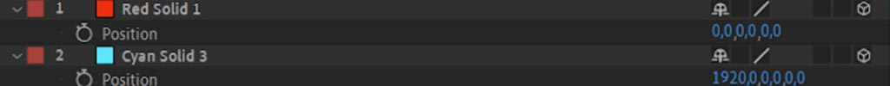

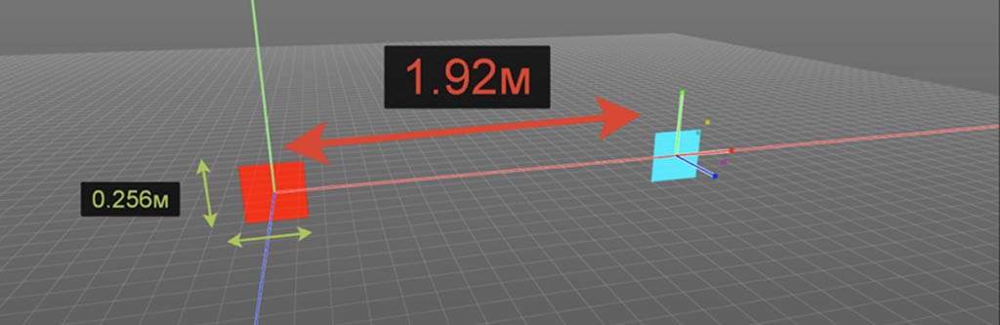

---
---

## 1.2. Эффекты наложения слоев и Track Matte

- Track Matte (Подложки отслеживания);
- Parent Link к другому слою или его свойствам (Привязка);
- Blending Modes (Режимы наложения).

---

### 1.2.1. Поддерживаемые типы наложений слоев и их особенности

| Поддерживаемые режимы наложения из AE в данный момент | Ограниченная поддержка (результат может отличаться от After Effects) |
|:-----------------------------------------------------:|:--------------------------------------------------------------------:|
|  Linear Color | Pin Light |
| Silhouette Alpha | Hard Mix |
| Screen | Linear Light |
| Add | Difference |
| Lighten | Classic Color Dodge |
| Dissolve | Exclusion |
| Dancing Dissolve | Subtract |
| Darken | Divide |
| Multiply | Hue |
| Color Burn | Saturation |
| Linear Burn | Color |
| Darker Color | Luminosity |
| Linear Dodge | Stencil Alpha |
| Lighter Color | Stencil Luma |
| Soft Light | Silhouette Luma |
| Color Dodge | Classic Color Burn |
| Vivid Light | Lighter Color Dodge |
| | Hard Light |
| | Overlay |

---
---

## 1.3. Работа с масками слоев

Ограничения при работе с Масками Слоёв:

- При булевых операция с масками, тип Intersect не должен идти первым. В этом случае, первую маску в режиме Intersect следует поменять на Add.

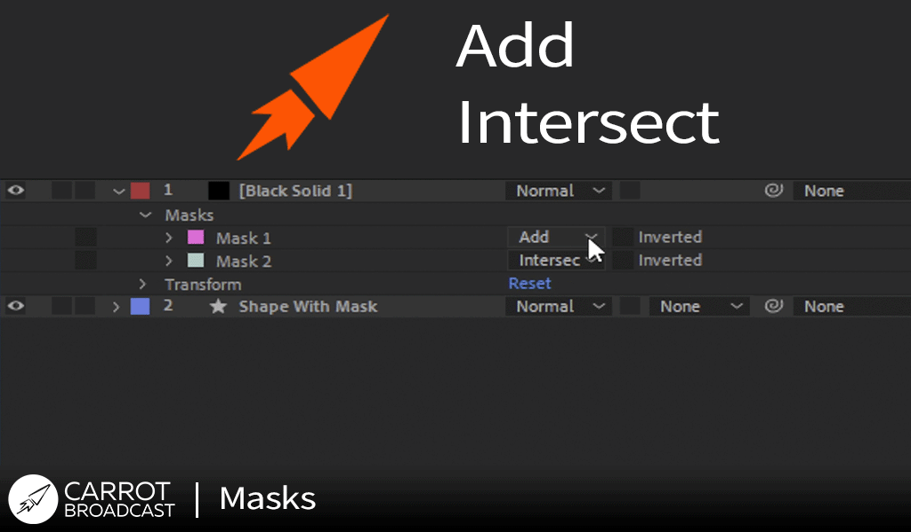

- Мask Feather использует исключительно билинейную интерполяцию (важно учитывать при масках с острыми углами и высоким значением Feather).
- Отрицательное значение свойства Мask Expansion использует проприетарный алгоритм отличный от After Effects, результат необходимо контролировать в Template Preview.
- Тип маски None в Carrot делает весь слой невидимым.

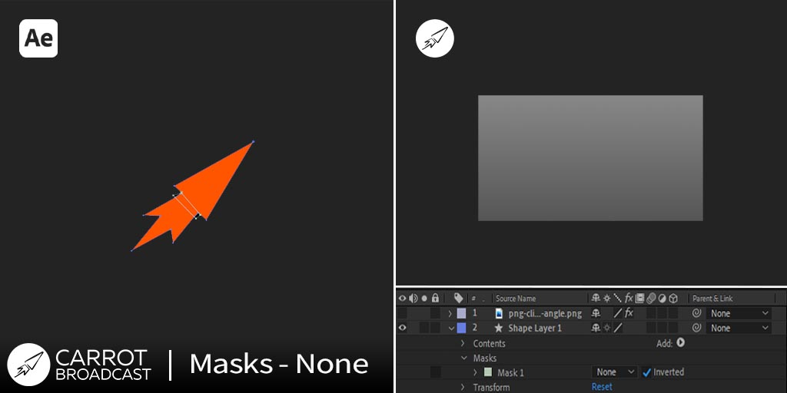

---
---

## 1.4. Анимация слоев

Необходимо ставить ключи анимации на всех вложенных композициях, иначе содержимое не будет обновляться при воспроизведении в Carrot. Более подробно о подготовке ключей анимации при экспорте шаблонов в Сarrot [читайте в п. 7.1.](export.md)

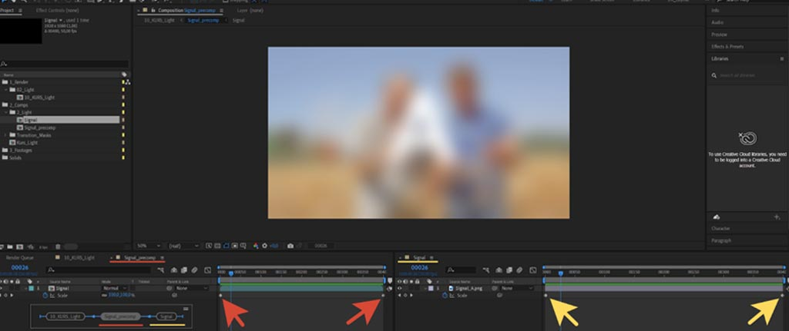

---

[Вернуться на прошлую страницу](user-guide.md)