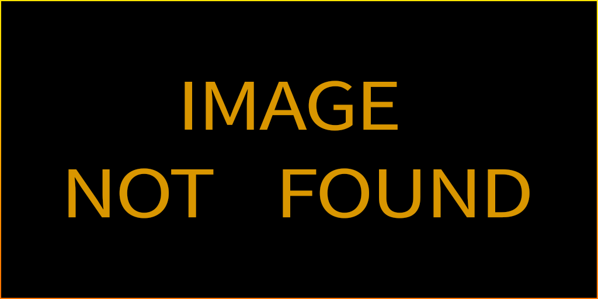

# Работа со слоями
## Поддерживаемые типы слоев
---
Carrot Engine поддерживает следующие типы слоев из After Effects при экспорте с помощью Carrot AE Plugin:

- Null Layer;
 - 

   
Null Layer

   

 

---
- Solid Layer;

- Shape Layer;

- Text Layer;

- Media Layer (MP4, MOV, JPG, PNG, PSD и т.д.).

