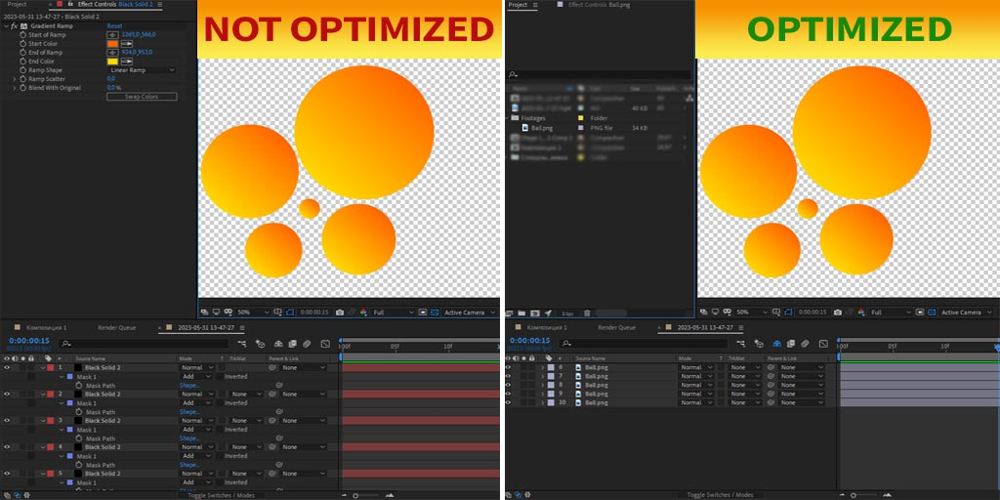
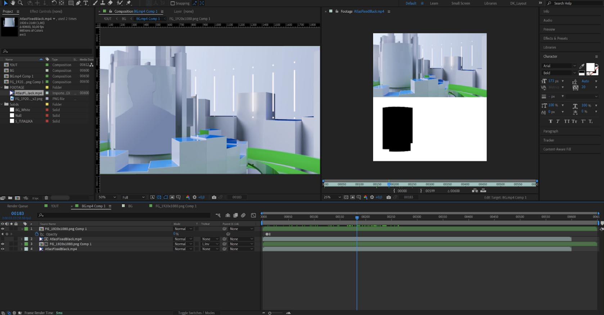
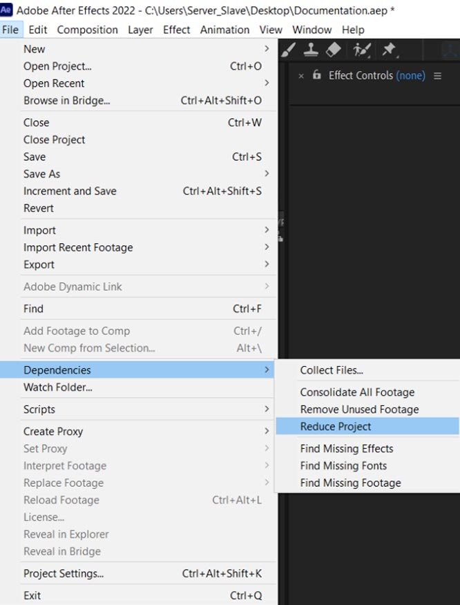
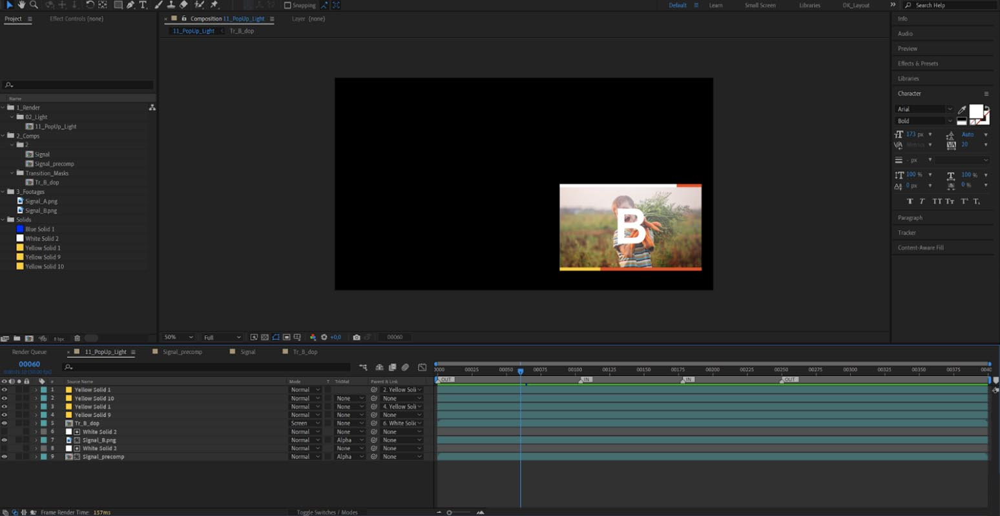
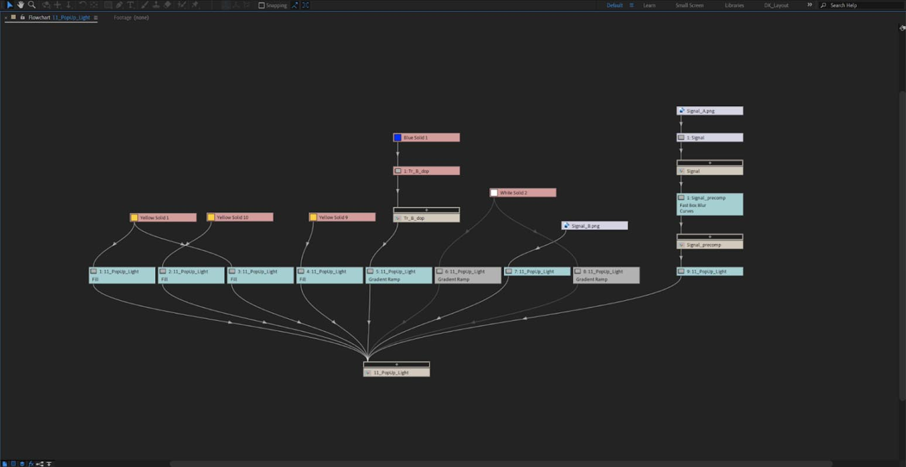
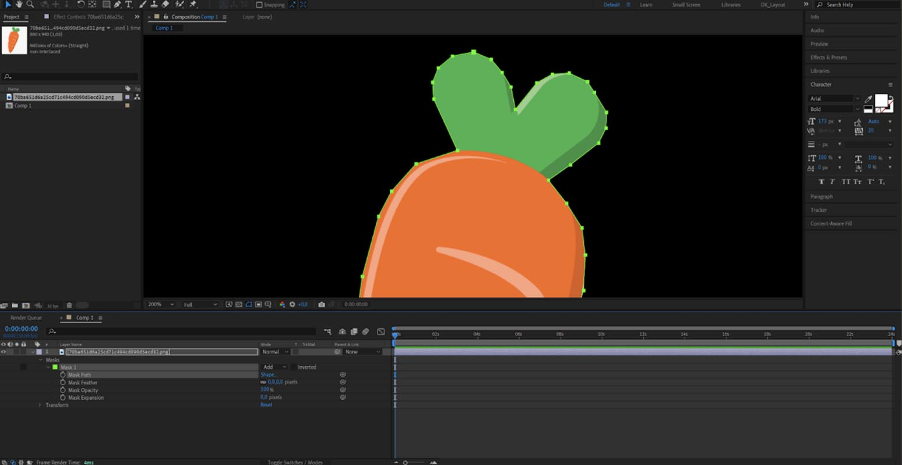

# 6. Оптимизация

## 6.1. Правила оптимизации

Для сохранения производительности рекомендуется использовать `PNG`, как альтернативу `Solid` с круглыми масками и эффектом градиента.

---
---

Используем вместо нескольких видео - **1 видеоатлас**.

## 6.2. Уборка мусора

Перед экспортом надо нажать на головную композицию и сделать `File - Dependencies - Reduce Project`.

---
---

## 6.3. Размер и количество композиций

Рекомендуются избегать избыточных вложений `Precomposition` и держать глубину вложенности проекта в пределах **1-2 композиций**.

> Рекомендуется уменьшение общего числа композиций и количества одновременно используемых эффектов.

---
---

## 6.4. Работа с масками в кривых

Маски с кривыми могут негативно повлиять на производительность при больших разрешениях композиции, рекомендуется использовать острые углы или `png`. 

---

[Вернуться на прошлую страницу](user-guide.md)